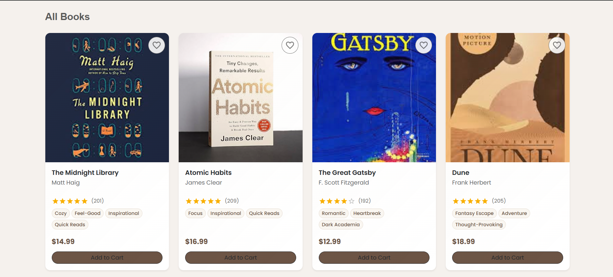
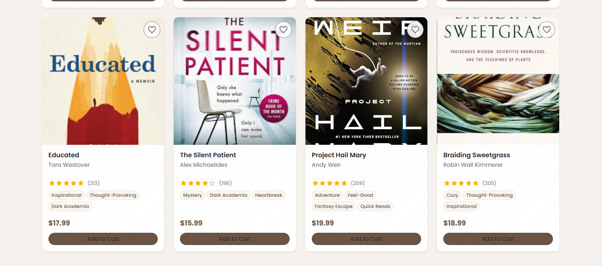
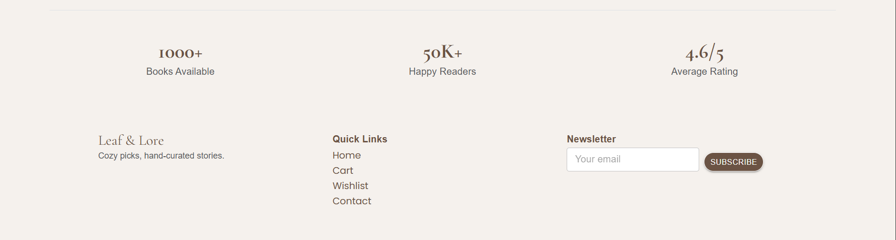

# Leaf & Lore – Book Store Frontend 📚🍃

## Case Study: Design and Development of a Single Page Application (SPA)  
**Using React, Bootstrap, and Material UI**

---

## 1. Introduction

Single Page Applications (SPAs) are modern web applications that load a single HTML page and dynamically update content without reloading the entire page. SPAs provide smooth user interaction, faster navigation, and improved user experience.

This project presents the **design and development of a bookstore frontend application** named **Leaf & Lore**, built using **React** along with **Bootstrap** and **Material UI** as UI component libraries.

---

## 2. Project Overview

**Leaf & Lore** is a responsive bookstore frontend that allows users to:
- Browse books visually
- Filter books by mood and category
- View ratings, prices, and tags
- Interact with cart and wishlist UI elements

This project focuses on **UI design, component-based architecture, and responsive layout**, without backend integration.

---

## 3. Features

- Clean and minimal bookstore UI
- Search bar for books and authors (UI only)
- Mood-based filtering (Cozy, Adventure, Mystery, etc.)
- Category-based filtering (Fiction, Self-help, Sci-Fi, etc.)
- Book cards with:
  - Cover image
  - Author name
  - Ratings
  - Tags
  - Price
- Cart and Wishlist buttons
- Fully responsive design

---

## 4. Technology Stack

- **React (Vite)**
- **Bootstrap 5**
- **Material UI (MUI)**
- **JavaScript (ES6+)**
- **HTML5 & CSS3**

---

## 5. Screenshots

> All screenshots are stored in the `screenshots/` folder.

### Home Page

### Mood, Category Filters (Books Grid)

### Books Grid

### Footer Section

---

    