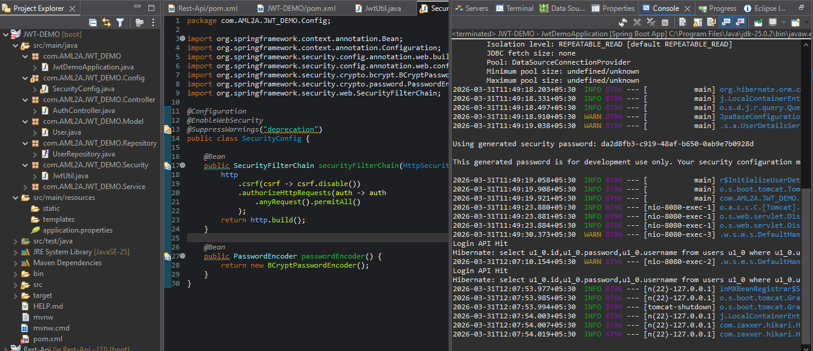
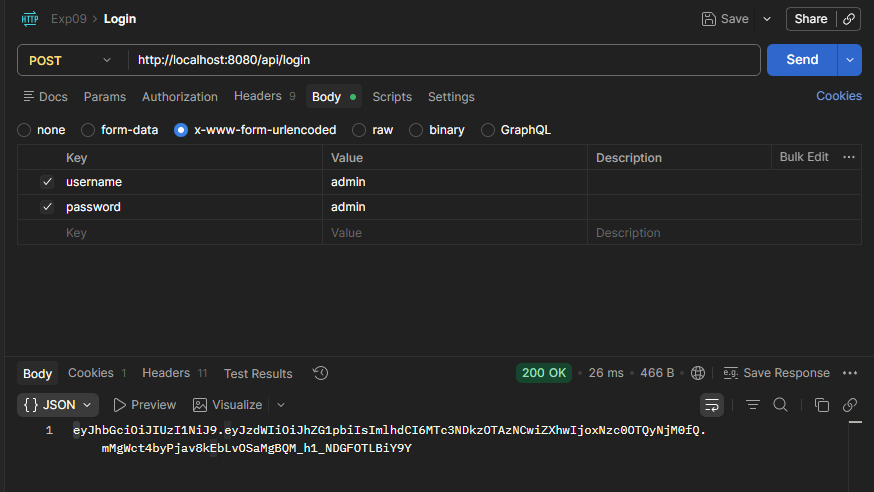
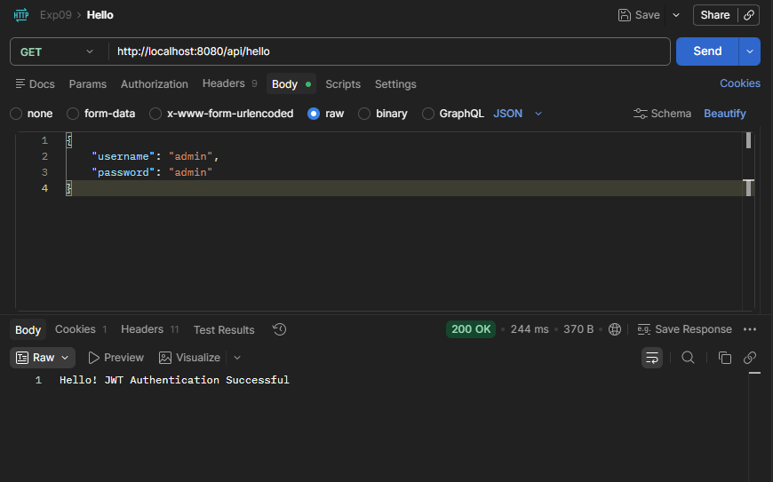

# JWT-DEMO

A Spring Boot application demonstrating JWT (JSON Web Token) authentication and authorization.

## Overview

This project is a comprehensive authentication demo built with Spring Boot that showcases:
- User authentication with JWT tokens
- Secure password handling
- Role-based access control
- RESTful API endpoints with security

## Technology Stack

- **Framework**: Spring Boot 4.0.5
- **Language**: Java 25
- **Authentication**: JWT (JJWT library v0.11.5)
- **Build Tool**: Maven
- **Database**: H2 (embedded)

## Project Structure

```
src/
├── main/java/com/AML2A/JWT_DEMO/
│   ├── JwtDemoApplication.java       # Main application entry point
│   ├── Config/
│   │   └── SecurityConfig.java       # Spring Security configuration
│   ├── Controller/
│   │   └── AuthController.java       # Authentication REST endpoints
│   ├── Model/
│   │   └── User.java                 # User entity
│   ├── Repository/
│   │   └── UserRepository.java       # Data access layer
│   ├── Security/
│   │   └── JwtUtil.java              # JWT token generation and validation
│   ├── Service/
│   │   └── AuthService.java          # Authentication business logic
│   └── resources/
│       └── application.properties    # Application configuration
└── test/
```

## Features

- ✅ User registration and login
- ✅ JWT token generation and validation
- ✅ Secure password encryption
- ✅ Protected API endpoints
- ✅ Role-based authorization

## Getting Started

### Prerequisites
- Java 25 or higher
- Maven 3.6+

### Installation & Running

1. Clone the repository:
```bash
git clone <repository-url>
cd JWT-DEMO
```

2. Build the project:
```bash
mvn clean install
```

3. Run the application:
```bash
mvn spring-boot:run
```

The application will start on `http://localhost:8080`

## Screenshots

### Eclipse IDE - Application Running


### Login Page


### Welcome Page


## API Endpoints

### Authentication
- `POST /auth/login` - Authenticate and receive JWT token
- `GET /auth/hello` - Protected endpoint (requires valid JWT token)

## Configuration

Update `application.properties` to customize:
- Server port
- Database connection
- JWT secret key
- Token expiration time

## Security

- Passwords are encrypted using bcrypt
- JWT tokens are signed with a secret key
- Sensitive endpoints are protected with Spring Security
- CORS configuration for cross-origin requests

