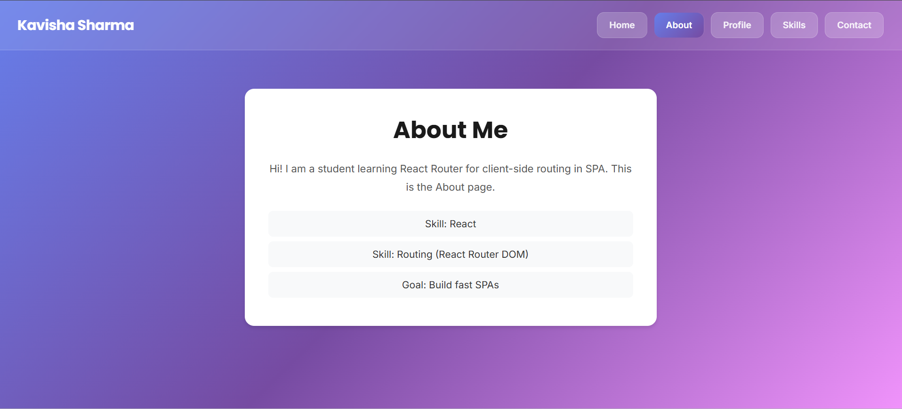
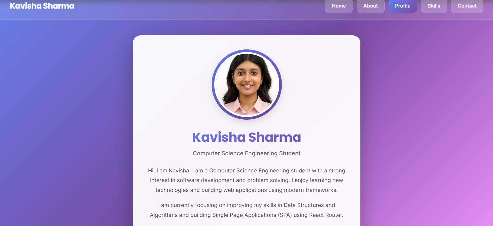
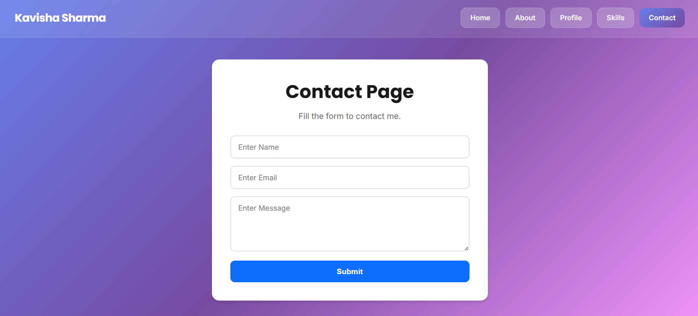
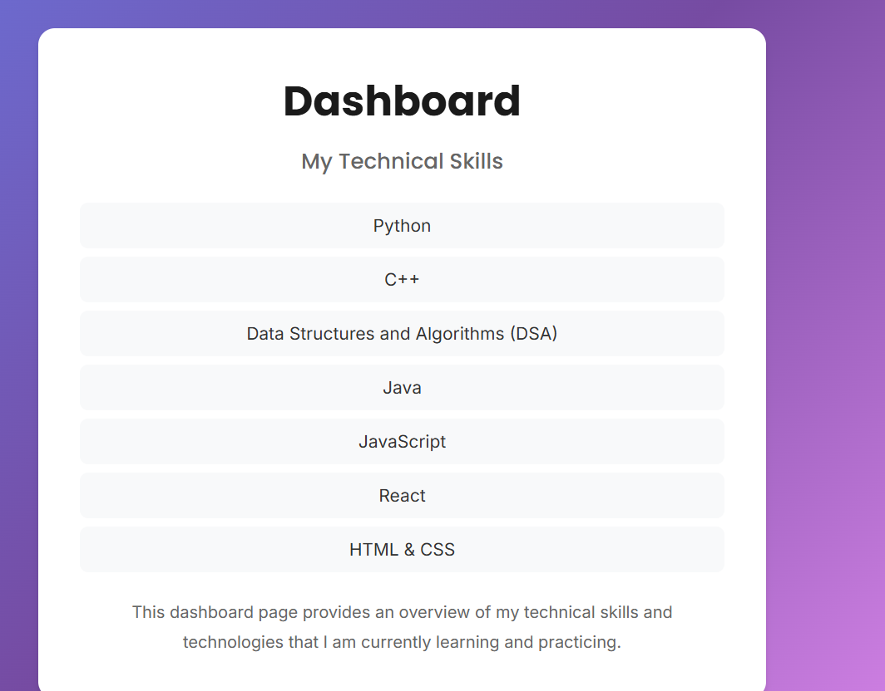

# EXP 3: React Router Implementation (Vite + React)

This experiment demonstrates the implementation of **client-side routing** in a React application using **React Router DOM**.  

The project includes multiple pages such as **Home, About Me, Profile, Contact Me, and Skills**, with navigation handled through a reusable **Navbar component**.

This setup ensures smooth page transitions without reloading the browser.

---

## 📌 Features

- React Router DOM integration
- Multiple navigable pages
- Reusable Navbar component
- Clean project structure (components + pages separation)
- Fast development setup using Vite
- Responsive layout

---

## 🧱 Tech Stack

- React (Vite)
- React Router DOM
- JavaScript (ES6)
- CSS

---


---

## 🌐 Routes Used

| Route | Component |
|--------|------------|
| `/` | Home |
| `/about` | About |
| `/profile` | Profile |
| `/contact` | Contact |
| `/skills` | Skills |
| `*` | Fallback / Redirect |

---

# 📸 Screenshots

## 🏠 Home Page


---

## 👩‍💻 About Me Page


---

## 👤 Profile Page


---

## 📞 Contact Me Page


---

## 🛠 Skills Page


---

## ⚙️ Installation & Setup

### 1️⃣ Install Dependencies
```bash
npm install


