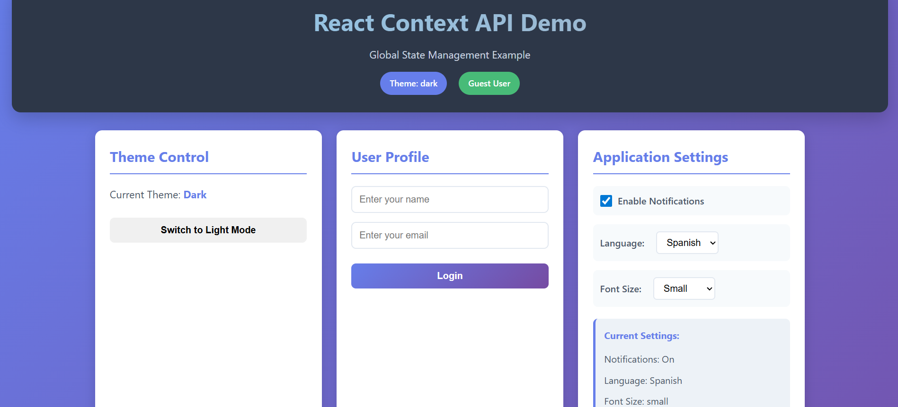
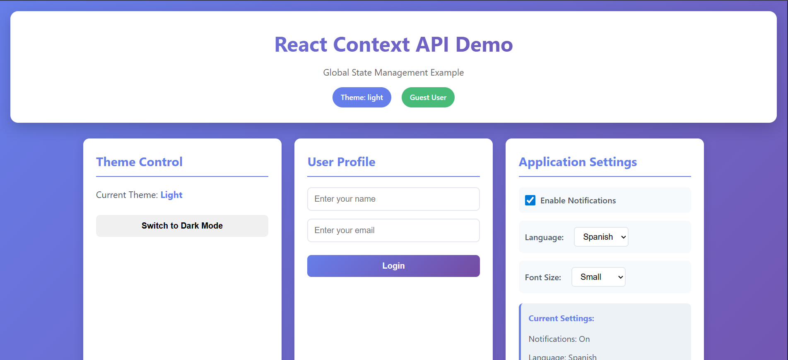

# Experiment 1 – Global State Management Using React Context API

## Aim
To implement global state management in a Single Page Application using the React Context API.

---

## Software Requirements
- Node.js  
- React  
- Code Editor (VS Code)  
- Web Browser  

---

## Theory
In React applications, passing data through multiple components using props can become complex, a problem known as **prop drilling**.  
The React Context API provides a way to share global data such as theme preferences, user information, and application settings across components without passing props manually at every level.

---

## Procedure
1. Create a React application.
2. Create a context using `createContext()`.
3. Wrap the application with a Context Provider.
4. Store and update global state in the Provider.
5. Consume state in child components using `useContext()`.

---

## Screenshots

> 📁 All screenshots are stored inside the `screenshots/` folder.

---

### React Context API – Dark Theme (Logged In User)

---

### React Context API – Dark Theme (Guest User)

---

### React Context API – Light Theme

---

### Theme Control, User Profile & Application Settings

---

## Result
- Global state successfully shared across components  
- Eliminated prop drilling  
- Improved maintainability and scalability  

---

## Conclusion
The React Context API enables efficient global state management in Single Page Applications by allowing shared access to data such as themes, user profiles, and application settings without complex prop passing.
