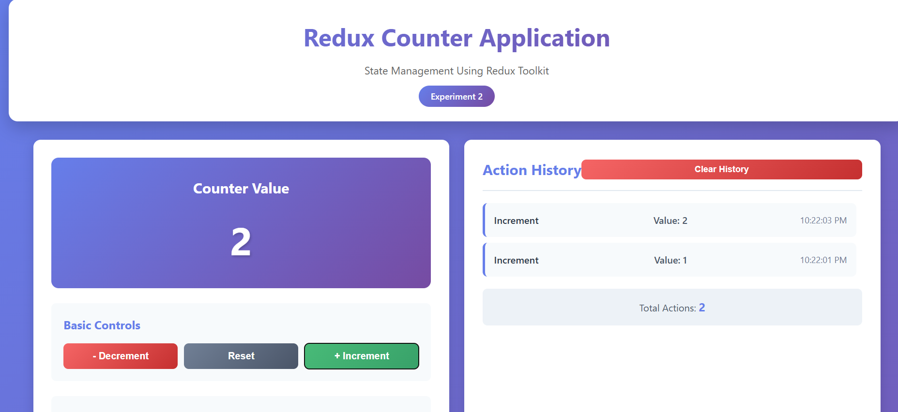

# Experiment 2 – State Management Using Redux (Counter Application)

## Aim
To implement centralized state management using Redux Toolkit in a React application.

---

## Software Requirements
- Node.js  
- React  
- Redux Toolkit  
- React-Redux  
- Code Editor (VS Code)  
- Web Browser  

---

## Theory
Redux is a predictable state container for JavaScript applications.  
It stores the application state in a single global store and updates it using **actions** and **reducers**.  
Redux Toolkit simplifies Redux implementation by reducing boilerplate code and providing standardized best practices for state management.

---

## Procedure
1. Install Redux Toolkit and React-Redux.
2. Create a Redux store.
3. Define a slice with actions and reducers.
4. Provide the store to the application using a Provider.
5. Access and update state using Redux hooks.

---

## Screenshots

> 📁 All screenshots are stored inside the `screenshots/` folder.

---

### Redux Counter – Initial State

---

### Redux Counter – Increment Action

---

### Redux Counter – Multiple Actions with History

---

## Result
- Centralized state management achieved using Redux  
- State updates handled predictably through actions  
- Improved scalability and maintainability  

---

## Conclusion
Redux Toolkit provides an efficient and structured approach to managing global state in React applications.  
By using a single store and predefined reducers, application behavior becomes more predictable and easier to debug.
