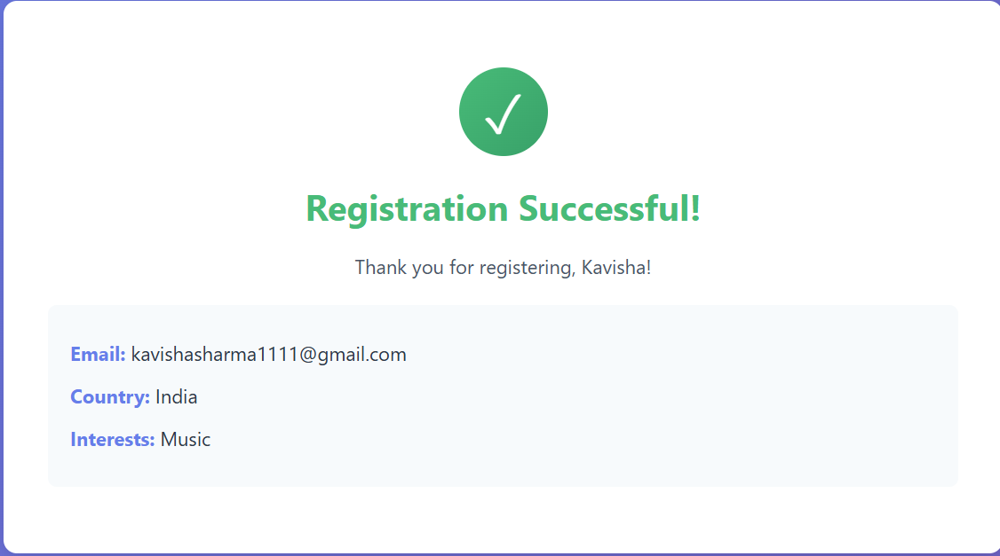

# Experiment 1 – Handling Forms Using Controlled Components

## Aim
To create and handle forms in a frontend application using controlled components in React.

---

## Software Requirements
- Node.js  
- React  
- VS Code  
- Web Browser  

---

## Theory
Controlled components are React components in which form data is handled by the component’s state.  
Each input element is connected to state variables, giving React full control over user input.  
This approach enables validation, conditional rendering, and real-time form data handling.

---

## Procedure
1. Create a React application.
2. Create a form component.
3. Use `useState` to store input values.
4. Handle input change events.
5. Submit the form using an event handler.

---

## Screenshots

> 📁 All screenshots are stored inside the `screenshots/` folder.

---

### User Registration Form

---

### Form Inputs Filled Using Controlled Components

---

### Registration Successful Output

---

## Result
- Form inputs successfully controlled using React state  
- User input captured and validated efficiently  
- Form submission handled without page reload  

---

## Conclusion
Controlled components provide complete control over form data in React applications.  
They enable efficient input handling, validation, and predictable form behavior, making them ideal for building dynamic and interactive forms.
