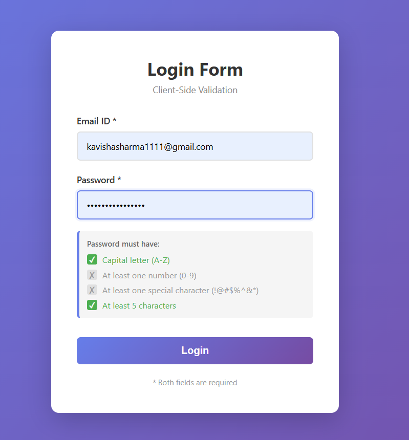
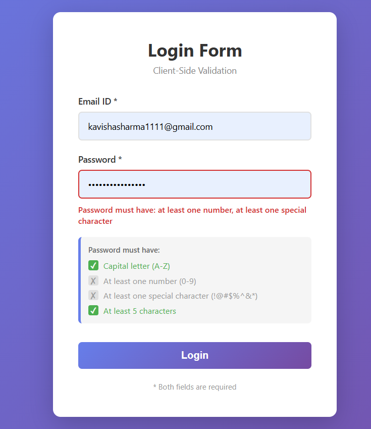
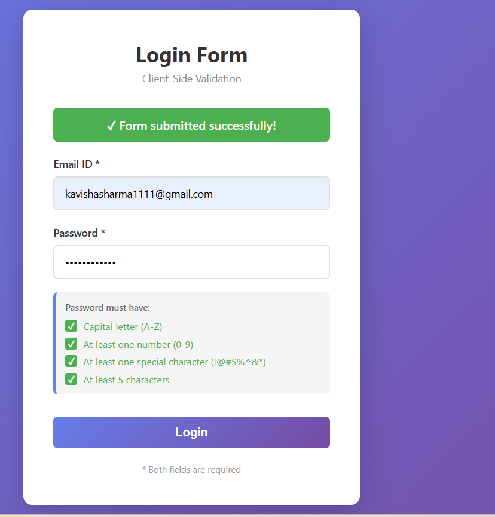
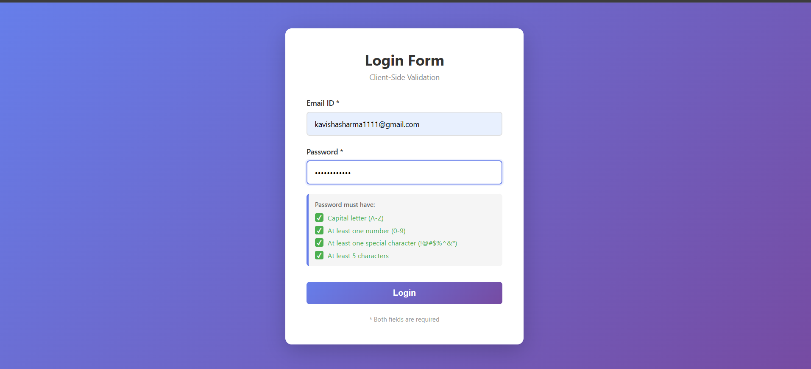

# Experiment 6.2 – Client-Side Form Validation (Login Form)

## Aim
To validate form inputs on the client side before submission.

## Requirements
The login form contains **only two fields**:
1. Email ID  
2. Password  

### Email Validation Rules
- Email must contain `@`
- Email must end with `.com`, `.in`, or any valid country code (e.g., `.uk`, `.us`)

### Password Validation Rules
The password must:
1. Start with a **capital letter (A–Z)**
2. Contain **at least one number (0–9)**
3. Contain **at least one special character** (`!@#$%^&*`)
4. Have **minimum 5 characters**

---

## Theory
Client-side validation ensures correctness of user data and provides immediate feedback without server interaction. It improves user experience and prevents invalid data submission.

---

## Procedure
1. Create a login form with Email ID and Password fields.
2. Apply validation rules using JavaScript.
3. Display error messages for invalid inputs.
4. Prevent form submission until all conditions are satisfied.
5. Display a success message on valid submission.

---

## Screenshots

### Login Form


### Invalid Password Validation


### Form Submitted Successfully


### Login Successful



---

## Result
The login form successfully validates email and password on the client side and allows submission only when all validation conditions are satisfied.

## Running the Project

```bash
npm install
npm run dev
```

Open your browser and navigate to `http://localhost:5173`

## Form Fields
1. **Email ID** - Required field with format validation
2. **Password** - Required field with multi-condition validation

## Technologies Used
- React
- Vite
- CSS3
