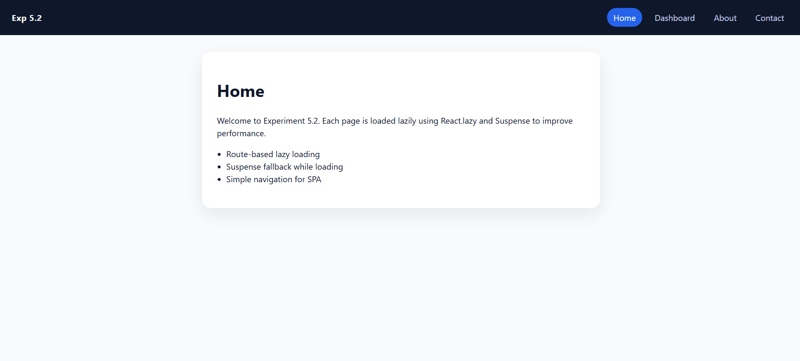
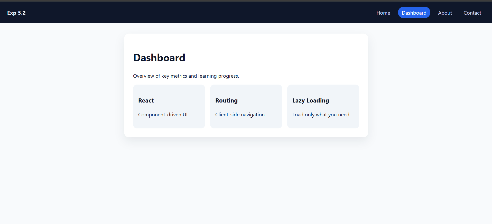
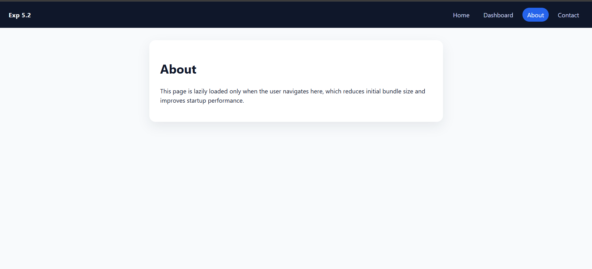
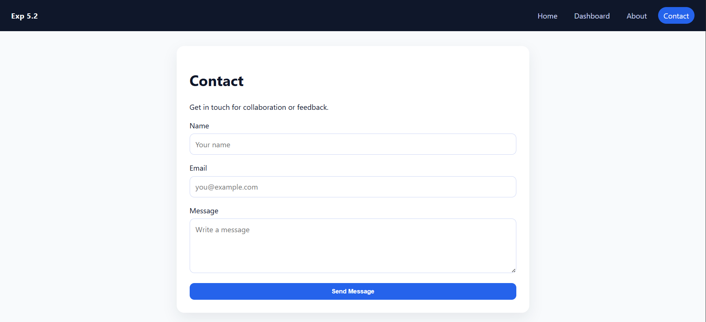
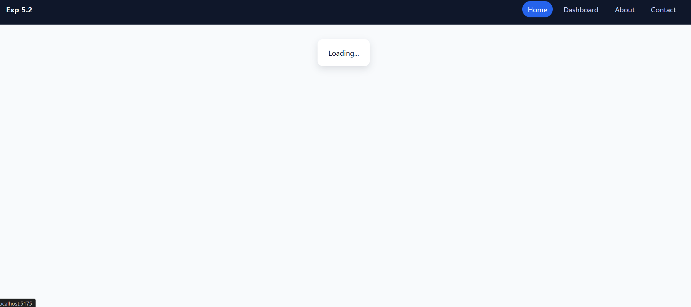

# Experiment 5.2 – Route-Based Lazy Loading in SPA

## Aim
To implement route-based lazy loading to improve performance in a Single Page Application.

---

## Theory
Route-based lazy loading ensures that components associated with specific routes are loaded only when the user navigates to that route.  
This reduces the initial bundle size and improves application startup performance.

---

## Procedure
1. Install React Router DOM.
2. Create multiple route-based components.
3. Apply lazy loading to route components.
4. Use Suspense to display a fallback UI while components are loading.

---

## Screenshots

> 📁 All screenshots are placed inside the `screenshots/` folder.

---

### Home Page

---

### Dashboard Page

---

### About Page (Lazy Loaded)

---

### Contact Page

---

### Loading State (Suspense Fallback)

---

## Result
- Reduced initial load time  
- Improved application performance  
- Components loaded only when required  

---

## Conclusion
Route-based lazy loading optimizes Single Page Applications by loading components on demand, leading to faster startup times and better user experience.
