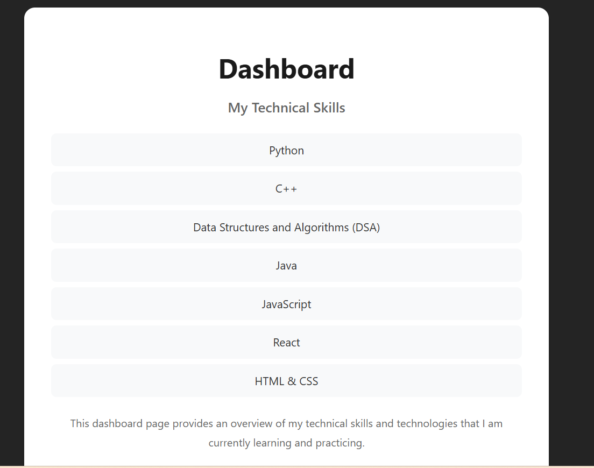

## Experiment-1: Component Lazy Loading (React.lazy + Suspense)

This experiment demonstrates **lazy loading** of the Dashboard component using `React.lazy()` and `Suspense`.
When the user navigates to Dashboard, the component loads only when needed, and a fallback UI is shown during loading.

### ✅ Dashboard UI

### ✅ Lazy Loading Fallback (Suspense)
When Dashboard is being loaded, the fallback screen appears:

