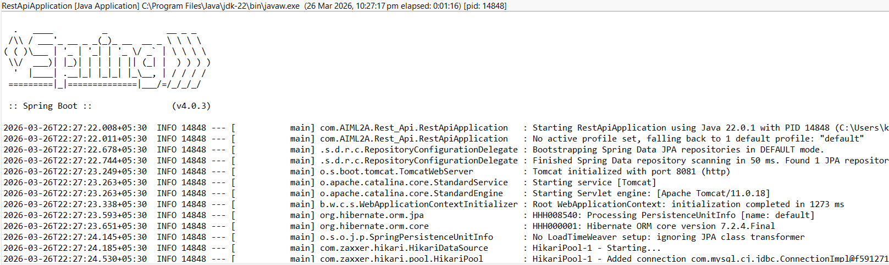
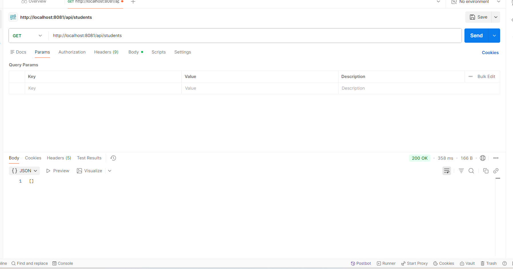
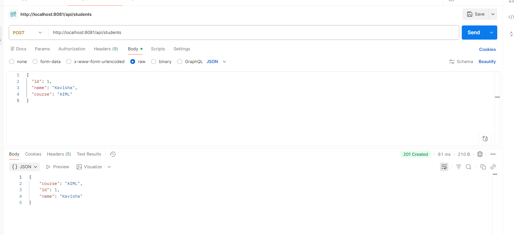
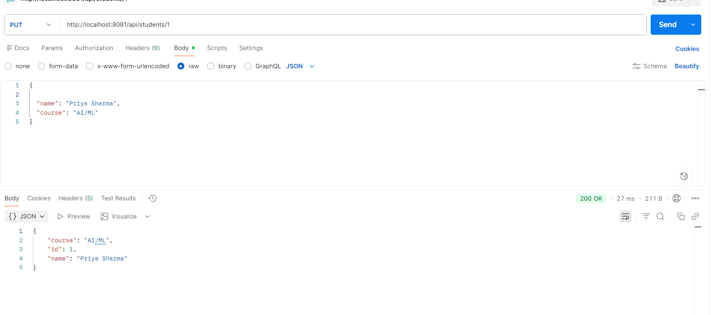
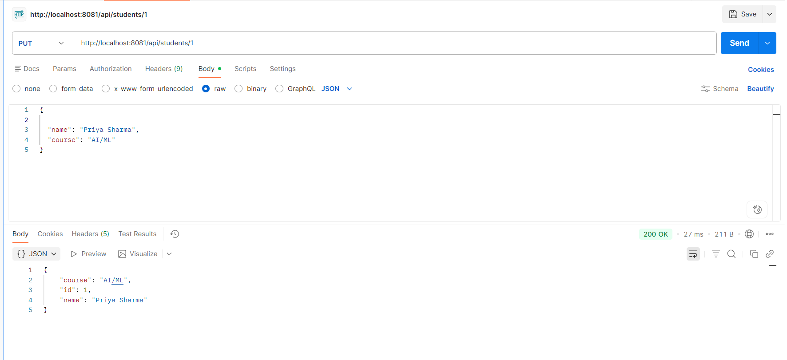
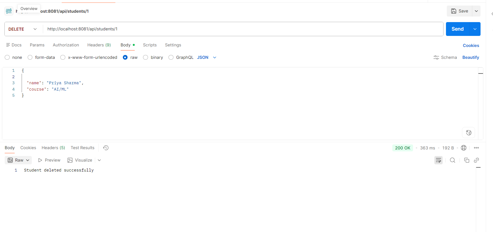

# Exp 8 - REST API

This experiment implements a Spring Boot REST API for Student management using Spring Web and Spring Data JPA. The application provides complete CRUD operations through the `/api/students` endpoint, including creating student records, retrieving all students or a single student by ID, updating existing records, and deleting records. The project follows a layered structure with controller, repository, and model components to keep the code organized and maintainable.

## API Endpoints

- GET `/api/students` - Fetch all students
- GET `/api/students/{id}` - Fetch student by ID
- POST `/api/students` - Create a new student
- PUT `/api/students/{id}` - Update an existing student
- DELETE `/api/students/{id}` - Delete a student by ID

## Running the Server

Use the following command from the `exp_8_restapi` folder:

```bash
./mvnw spring-boot:run
```

## Screenshots

### Screenshot 1


### Screenshot 2


### Screenshot 3


### Screenshot 4


### Screenshot 5


### Screenshot 6

